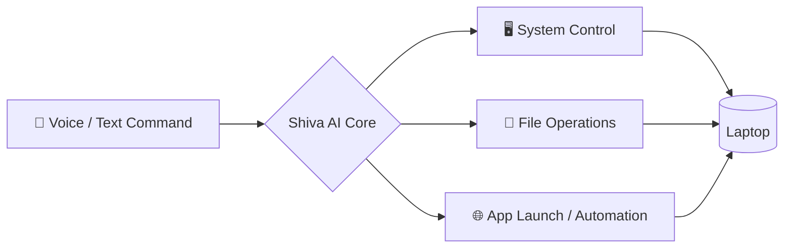

<div align="center">


<a href="https://git.io/typing-svg">
  
</a>

<br/><br/>


<br/><br/>


</div>

<br/>


<br/>

## `01` — WHO I AM

```typescript
const shreyas: Developer = {
  title: "BCA Student",
  location: "Delhi NCR, India",

  stack: {
    languages: ["Python", "JavaScript", "SQL", "HTML", "CSS"],
    runtime:   ["Node.js", "Jupyter"],
    databases: ["SQLite", "PostgreSQL"],
  },

  launchedProjects: [
    "Shiva AI  — a JARVIS-style assistant that controls my whole laptop",
    "Saathi AI — not a robot, a friend that lives inside your system",
  ],

  certifications: [],

  status:  "🟢 Learning fast, shipping faster",
  openTo:  ["Collaborations", "AI experiments", "Interesting problems"],
} as const;
```

<br/>


<br/>

## `02` — FEATURED BUILDS

<table>
<tr>
<td width="50%" valign="top">

### 🤖 Shiva AI
**Your laptop's own JARVIS.**
A voice/command-driven assistant built to take full control of your system — automation, execution, and control, all in one AI layer.


`Python` `Node.js` `SQLite`

<a href="https://github.com/pshreyas700-byte/shiva-ai"></a>

</td>
<td width="50%" valign="top">

### 💙 Saathi AI
**Not a robot. A presence.**
An AI companion that doesn't try to *look* human — it just lives quietly inside your system, there when you need it.


`Python` `Node.js` `SQLite`

<a href="https://github.com/pshreyas700-byte/saathi-ai"></a>

</td>
</tr>
</table>

<br/>

**How Shiva AI thinks:**



<br/>


<br/>

## `03` — TECH STACK

<div align="center">

**Languages**


**Runtime**


**AI / Data**


</div>

<br/>


<br/>

## `04` — GITHUB METRICS

<details open>
<summary><b>📊 Stats & Languages</b></summary>
<br/>

<p align="center">
  
  
</p>

</details>

<details open>
<summary><b>🔥 Streak</b></summary>
<br/>

<p align="center">
  
</p>

</details>

<details>
<summary><b>🏆 Trophies</b></summary>
<br/>

<p align="center">
  
</p>

</details>

<details>
<summary><b>📈 Activity Graph</b></summary>
<br/>

<p align="center">
  
</p>

</details>

<br/>


<br/>

## `05` — CONNECT

<div align="center">

<a href="mailto:pshreyas700@gmail.com"></a>
<a href="https://www.linkedin.com/in/shreyas-pathak-76b239334/"></a>

</div>

<br/>

<div align="center">
<i>"Not trying to build the next big thing. Just trying to build something that works, then something better."</i>
</div>

<br/>


</div>
